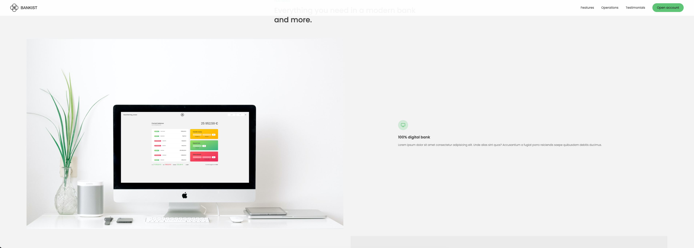

# Bankist

[](#)
> A minimal banking web app.

## Overview

**Bankist** is a modern and minimalistic banking web application that simulates basic banking operations. The app focuses on providing a clean, intuitive, and fully responsive interface for a smooth user experience across all devices.
## Preview

<p align="center">
  
</p>

## Features

- **User Login:** Access the app using demo account credentials included in the project.  
- **Fully Responsive Design:** Optimized layout for desktop, tablet, and mobile use.  
- **Clean and Modern UI:** Minimalistic interface for a distraction-free experience.

## Live Demo

**Explore the live version here:** [View Live Demo](https://marius-bank.netlify.app/)

## Local Setup

1. **Clone** the repository:
   ```bash
   git clone https://github.com/MIBogdan/bank-app.git
   ```
2. **Open** the `index.html` file in your browser
   *- or use a local development server (like VS Code Live Server) for a smoother development experience.*

---

## Author

**Marius Bogdan**  
[Personal portfolio](https://marius-bogdan.com/)

Feel free to reach out for any questions or collaborations!

## License

This project is provided for testing and demonstration purposes only. All rights are reserved. No part of this project may be redistributed, reuploaded, or used in any manner (commercially or otherwise) without explicit written permission from the author.
